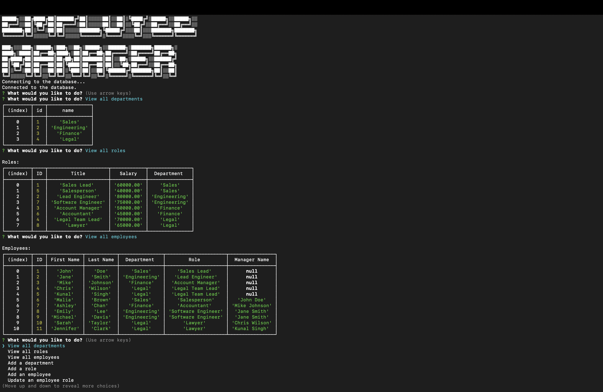

# SQL Employee Tracker

This command-line application allows you to manage a company's employee database. It is built using Node.js, Inquirer, and MySQL.



## Table of Contents

- [Installation](#installation)
- [Usage](#usage)
- [Technologies Used](#technologies-used)
- [Database Schema](#database-schema)
- [Functionality](#functionality)
- [Walkthrough Video](#walkthrough-video)
- [License](#license)

## Installation

1. Clone the repository:

   ```shell
   git clone https://github.com/EAnthonycarranza/employee-tracker.git
   ```

2. Install the required dependencies:

```shell
cd employee-tracker
npm install
npm install inquirer
```
3. Set up the database:

- Make sure you have MySQL installed on your machine.
- Open a MySQL client and create a database named employeeDB.
- Update the database configuration in the index.js file with your MySQL credentials.

4. Start the application:

```shell
node index.js
```

## Usage

- Follow the prompts in the command line to interact with the application. Use the arrow keys to navigate and select options.

## Technologies Used

The application is built using the following technologies:

- Node.js: A JavaScript runtime built on Chrome's V8 JavaScript engine.
- Inquirer: A command-line interface for collecting user input.
- MySQL: An open-source relational database management system.
mysql2/promise: A MySQL client for Node.js that supports Promises and async/await.

## Database Schema

The application uses the following database schema:

### department table:

- `id`: INT PRIMARY KEY
- `name`: VARCHAR(30)

### role table:

- `id`: INT PRIMARY KEY
- `title`: VARCHAR(30)
- `salary`: DECIMAL
- `department_id`: INT (foreign key referencing department.id)

### employee table:

- `id`: INT PRIMARY KEY
- `first_name`: VARCHAR(30)
- `last_name`: VARCHAR(30)
- `role_id`: INT (foreign key referencing role.id)
- `manager_id`: INT (foreign key referencing employee.id or null)

## Functionality

The application provides the following functionality:

1. View all departments: Displays a formatted table showing department names and IDs.
2. View all roles: Displays a formatted table showing job titles, role IDs, departments, and salaries.
3. View all employees: Displays a formatted table showing employee data, including IDs, names, job titles, departments, salaries, and managers.
4. Add a department: Prompts you to enter the name of the department and adds it to the database.
5. Add a role: Prompts you to enter the title, salary, and department for the role and adds it to the database.
6. Add an employee: Prompts you to enter the employee's first name, last name, role, and manager, and adds the employee to the database.
7. Update an employee role: Prompts you to select an employee to update and their new role, and updates the information in the database.
8. Delete: Allows you to delete a department, role, or employee from the database.
9. Exit: Exits the application.

## Walkthrough Video

A video demonstration of the application's functionality can be found at the following link:

[Link to Video]([insert_youtube_video_link_here](https://youtu.be/GHUOgAJSHPo))

## License

This project is licensed under the MIT License. See the [LICENSE](LICENSE) file for details.
